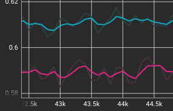
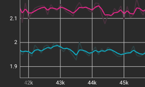

### MLM Dataset Preperation

The masking and generation of an MLM sample can be quite slow. Generating samples on the fly slows down the training. The machine may spend more time generating the samples than running the training loop. To alleviate this, preprocessed, cached datasets are created.

Preprocessing datasets and precaching the samples speed up the training. However, it also creates a challenge. When a sample is generated on the fly, each time we see a raw sample, in each epoch, we generate a different MLM puzzle with different tokens masked. For example:  

```
Raw sample: 
he made his fortune in the financial services industry and was best known for many world records.

Epoch 1: 
he made ___ fortune in the _________ services ________ and was best known for many world records. 

Epoch 2: 
__ made his fortune in the financial services industry and was best ____  ___ many world records.

```

When we use a single preprocessed dataset, the model sees the same puzzles in each epoch. To improve on this, we create multiple preprocessed datasets and round-robin them by epoch. This is done in trainer.py:  

`dataset_file = dataset_files[epoch % len(dataset_files)]`

### Two Dataset Create Methods for MLM Training: Text Segmentaion vs Token Splitting

Two methods of creating datasets are implemented. The first starts by splitting the text into segments and then turning each text segment into a sample. The second first tokenizes the entire text, then splits the list of tokens into exact and fixed-length segments.  

#### First Method - Text Segmention <a id="text-segmentation"></a>
In the first method, we assume that each token is, on average, about 4 characters. We split the text into segments of (seq-length - 2) * 4 characters. We add a token to the head and tail of each segment, which is why we subtract 2 from seq-length. This process is simple and quite fast but creates a few challenges.

The first problem is that the splitting doesn't adhere to word boundaries. As a result, there may be a word fragment at the beginning or end of the segment. These word fragments create two problems. They mess up the context/semantics of the segment. If they are masked, the model has very little chance of predicting these part-words, which will push down accuracy. 

The second problem is that the heuristic of 4 characters per token is an approximation. These segments may be translated to a varying number of tokens. If too few, we under-utilize the capacity of the model and GPU. If too many, we drop the excess and lose content.

#### Second Method - Token Splitting <a id="token-splitting"></a>
The text is cleaned by removing special characters and optionally normalizing white characters by replacing consecutive white characters with a single space. Then the text is tokenized. This leaves us with a long list of tokens. We then split the tokens into segments of exact and fixed length. This eliminates the two problems that the first method suffers from.

#### Comparative Analysis of Validation Accuracy and Loss Between Two Dataset Preparation Methods




In both charts, the pink line shows training with datasets of the first kind, and the blue line shows training with datasets of the second kind. The chart on the left shows validation accuracy. In this case, the better dataset yields better accuracy. The chart on the right shows validation loss. The "more perfect" dataset yields lower loss. All other parameters, as far as I can tell, were identical between the two training sessions.
