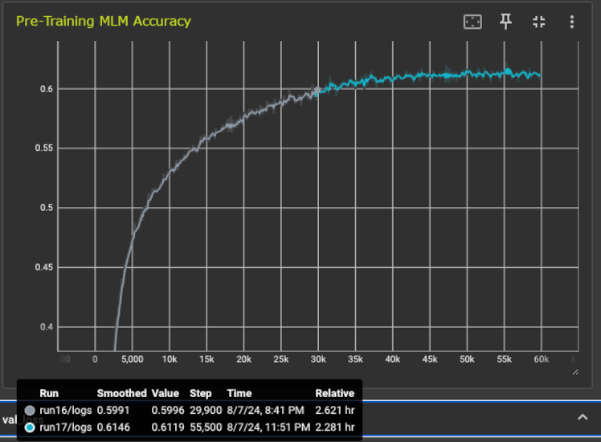
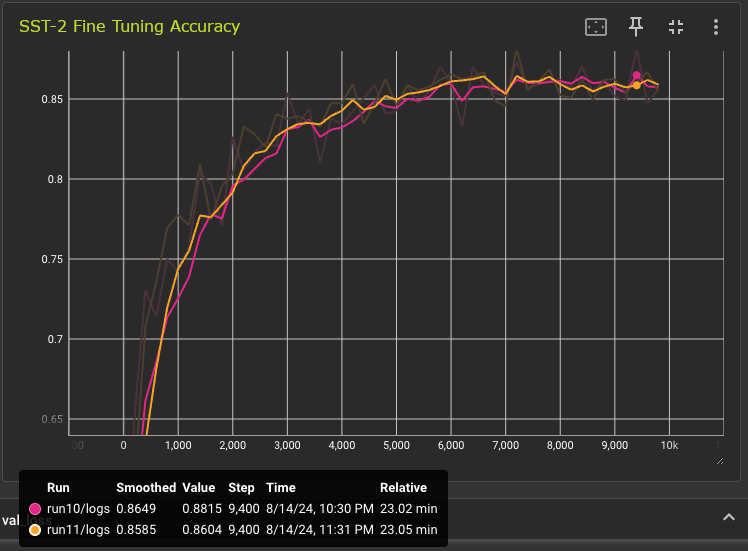

# BERT Model, MLM Pre-Training, and Binary Classification Fine-Tuning

### Based on and inspired by Andrej Karpathy's [nanoGPT](https://github.com/karpathy/nanoGPT) and [miniGPT](https://github.com/karpathy/minGPT)

I built this project in order to learn by doing the anatomy and implementation of the transformer architecture and the pre-training and fine-tuning training routines. Currently, the focus is on the BERT model. 

### Let's start with some results:
#### Pre-Training using MLM and the WikiText-103 dataset
(Fine-Tuning result [below](#fine-tuning-result))



The model achieved MLM accuracy **exceeding 60%** after pre-training from scratch on the WikiText-103 dataset. This is considered a good result. 

Here is a cherry-picked example. The first block shows the predictions inside /slashes/. The second block is the original text.

---

he fire fighters 
<span style="background-color: lightgreen;">**/./**</span> 
after seeing how upset susan is about the school , ben confesses 
<span style="background-color: lightgreen;">**/to/**</span> 
<span style="background-color: orange;">~~/to/~~</span> the fire . 
<span style="background-color: orange;">~~/she/~~</span> later learns that the school has 
<span style="background-color: lightgreen;">**/somehow/**</span> saved . reception 
<span style="background-color: lightgreen;">**/acc/**</span> 
<span style="background-color: lightgreen;">**/##ola/**</span> des woodburne has earned various award nominations for her role as susan . in 200 
<span style="background-color: orange;">~~/##7/~~</span> , she 
<span style="background-color: lightgreen;">**/was/**</span> /nominated/ for best female performance in a soap from 
<span style="background-color: lightgreen;">**/the/**</span> rose d 
<span style="background-color: lightgreen;">**/'/**</span> or awards . at the 2007 inside soap awards , wood 
<span style="background-color: lightgreen;">**/##burn/**</span>e was nominated 
<span style="background-color: lightgreen;">**/for/**</span> best actress , best couple with alan fletcher and best storyline for susan 
<span style="background-color: lightgreen;">**/and/**</span> karl 
<span style="background-color: lightgreen;">**/'/**</span> s wedding . t

---

he fire fighters 
<span style="background-color: lightgreen;">**.**</span> after seeing how upset susan is about the school , ben confesses 
<span style="background-color: lightgreen;">**to**</span> 
<span style="background-color: orange;">~~starting~~</span> the fire . 
<span style="background-color: orange;">~~susan~~</span> later learns that the school has <span style="background-color: lightgreen;">somehow</span> saved . reception 
<span style="background-color: lightgreen;">**acc**</span>
<span style="background-color: lightgreen;">**ola**</span> des woodburne has earned various award nominations for her role as susan . in 200
<<span style="background-color: orange;">~~5~~</span> , she 
<span style="background-color: lightgreen;">**was**</span> nominated for best female performance in a soap from 
<span style="background-color: lightgreen;">**the**</span> rose d 
<span style="background-color: lightgreen;">**'**</span> or awards . at the 2007 inside soap awards , wood
<span style="background-color: lightgreen;">**burne**</span> was nominated 
<span style="background-color: lightgreen;">**for**</span> best actress , best couple with alan fletcher and best storyline for susan 
<span style="background-color: lightgreen;">**and**</span> karl 
<span style="background-color: lightgreen;">**'**</span> s wedding . t

---

In this carefully selected example the model guessed 13 out of the 15 masked tokens, an accuracy of 87%. 

#### Fine-Tuning Using a Binary Classifier and the SST-2 Dataset<a id="fine-tuning-result"></a>

  

The model achieved a binary classification accuracy of approximately **87%** when fine-tuned on the SST-2 dataset. This is a solid result for a model of this size, pre-trained on a relatively modest dataset, WikiText-103, with a constrained budget. While the result is not extraordinary-after all, this implementation follows established techniques rather than introducing novel innovations-it demonstrates the robustness of the implementation, including  model construction, dataset preparation, training routines, hyperparameter tuning.


### Hyperparameters 
The above results were generated using the following setups:

##### MLM Pre-Training Parameters
```
task-type = mlm
seq-len = 128
batch-size = 100
val-interval = 100
d-model = 768
heads = 12
n-layer = 6
dropout = 0.35

async-to-device: true
fused-adamw: true
compile: true

learning-rate = 1.0e-3
min-learning-rate = 5e-5
warmup-iters = 1000
lr-decay-iters = 45_000
max-iters = 60_000
weight-decay = 0.01

case = dickens # TODO: rename
base-dir = wiki
# supports round-robin of datasets
dataset-pattern = train_weke_128_*.msgpack
val-dataset-pattern = val_weke_128_*.msgpack
# DDP
dist-master-addr = 127.0.0.1
dist-master-port = 12233
# misc
max-checkpoints = 1
wandb = false
``` 

##### SST-2 Binary Classification Fine-Tuning Parameters 
```
task-type = sst2
seq-len = 128
batch-size = 64
val-interval = 200
d-model = 768
heads = 12
n-layer = 6
dropout = 0.0

async-to-device: true
fused-adamw: true
compile: true

learning-rate = 6e-5
min-learning-rate = 1e-7
warmup-iters = 300
lr-decay-iters = 8000
max-iters = 10000
weight-decay = 0.02

case = dickens # change to something meaningful
base-dir = wiki
# for sst2, the file names are hardcoded in sst2_dataset.py
# dataset-pattern = train_weke_256_*.msgpack
# val-dataset-pattern = val_weke_256_*.msgpack
# DDP
dist-master-addr = 127.0.0.1
dist-master-port = 12233
# misc
max-checkpoints = 1
wandb = false
``` 

Adjust the dataset patterns towards the bottom of the config file to match your datasets.

## Pre-Training the Model

### Dataset Generation

See [here](./dataset_preparation.md) a discussion of two methods of generating precached datasets. 

#### Download Dataset 
I used WikiText-103 which can be downloaded from [Kaggle](https://www.kaggle.com/datasets/dekomposition/wikitext103).

This dataset is quite large, if you just experimenting, I suggest you chop it up.  

`tail -n 180k ignore/wiki/wiki.train.tokens > ignore/wiki/wiki.train.tokens.180`

#### Generation Scripts

There are two sets of utilities to generate MLM precached datasets. 

#### Text Segmentation
Text segmentation is [explained here](./dataset_preparation.md#text-segmentation).

Use:  [prepare_mlm_dataset.py](./scripts/prepare_mlm_dataset.py)  

`prepare_mlm_dataset.py [-h] -i INPUT -l LABEL -o OUTPUT -m MAX_LEN -v VOCAB [-s SEED]`

Example:  
`python prepare_mlm_dataset.py -i wiki.train.tokens -l wiki -o wiki/datasets
                                -m 128 -v wiki/vocab`

This will generate three files:
* `wiki/datasets/train_wiki_128_123.msgpack.gz`
* `wiki/datasets/val_wiki_128_123.msgpack.gz`
* `wiki/datasets/test_wiki_128_123.msgpack.gz`

128 is sequence length  
123 is the seed of the random number generator  
wiki is the label

#### Token Splitting

#### TBD

See:  
[tokenize_text.py](./scripts/tokenize_text.py), and  
[prepare_mlm_fixed_len_dataset_from_ids.py](./scripts/prepare_mlm_fixed_len_dataset_from_ids.py).

tokenize_text.py convert the text to a list of token ids.  
prepare_mlm_fixed_len_dataset_from_ids.py uses the output of tokenize_text to create samples by token splitting.

### How to run Pre-Training
pip install -r requirements.txt

```sh
mkdir wiki wiki/input wiki/vocab wiki/datasets wiki/runs
```

#### Download a vocab.txt

For example, download it from [Hugging Face](https://huggingface.co/google-bert/bert-base-uncased/tree/main), or find it under [etc/vocab/vocab.txt](./etc/vocab/vocab.txt). I experimented with both. In my experience, training runs faster, consumes less memory, and yield better results with the smaller vocabulary.  

You want to copy it to `<base-dir>/vocab`

#### Install and adjust the config file

`cp etc/templates/config_template.ini config.ini`

if you are running on a machine without gpu/cuda, see `local_config_template.ini` for more modest settings.

if you're using `local_config.ini`, edit that file, otherwise edit `config.ini`

`seq-len` needs to match the max len of your dataset  
`batch-size` needs to fit the memory of your GPU  
`case = dickens` for now, will be changed to mlm later  
`base-dir = wiki`  

start the training:  
```sh
python src/main.py
```

if you're lucky and have multiple gpus you may use:  
```sh
python src/main.py --ddp --nproc 2
```  
adjust `nproc` to the number of GPUs available.

### Fine-Tuning 

Download and copy the dataset to `<base-dir>/datasets`, for example, copy 
`{train|validation|test}-00000-of-00001.parquet` files from the SST-2 dataset into the datasets directory.

See settings in [etc/templates/config_sst2.ini](./etc/templates/config_sst2.ini) for the relevant values to be used for fine-tuning. You config file still needs to be named config.ini.

You need to start from a checkpoint created during the pre-training to begin fine-turning:

For example:   

`python src/main --cp wiki/runs/run0/checkpoints/checkpoint.pt`

DDP is not supported for the fine-tuning (which requires far fewer resources anyway.)


### Your directory structure should look something like:
```
<project-base>  
scripts...   
src...  
wiki
  - vocab
    - vocab.txt  // source to be determined...
  - datasets   
    // the files generated by prepare_mlm_dataset.py described above 
    - train_data_xyz.msgpack.gz
    - val_data_xyz.msgpack.gz
    - test_data_xyz.msgpack.gz
  - runs
    - run0    // these directories are created during training
      - logs
        - log.txt
        - events log file
      - checkpoints
         checkpoint.pt
  ```


### Todo:
* Adjust the model to also support the GPT model and train it
* ~~Fine tune the model. So far I only pre-trained it~~ **Done!**
* Create a inference use case example
* Consider adopting more changes from DistilBERT
